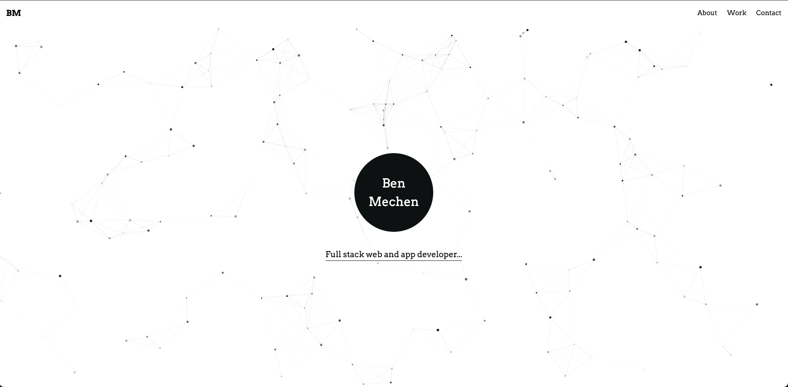

# Personal Portfolio

[](https://app.netlify.com/sites/ben-mechen-portfolio/deploys)

<div align="center">
  
</div>

<div align="center">
  <strong>A <a href="https://www.gatsbyjs.org/">Gatsby</a> portfolio SPA styled using <a href="https://tailwindcss.com/">Tailwind CSS</a>, a utility-first CSS framework.</strong><br />
  Uses <a href="https://www.purgecss.com/">PurgeCSS</a> to remove unused CSS.<br />
  <br />
  <br />
</div>
  

  
<p align="center">View site <a href="https://ben.mechen.co">here</a>.</p>
## Get started

Install the Gatsby CLI:

```sh
npm i --global gatsby-cli
```

Create a new Gatsby project using this starter:

```sh
gatsby new my-new-website https://github.com/taylorbryant/gatsby-starter-tailwind
```

Build a stylesheet from your Tailwind CSS config and run the project in development mode:

```sh
cd my-new-website
npm run develop
```

## Format and lint

-   `npm run analyze` - See what ESLint and Prettier can fix
-   `npm run fix` - Run Prettier and ESLint with the `--fix` option

## Build your site

Use `npm run build` to build your site for production.

## Deployment

### Netlify

[](https://app.netlify.com/start/deploy?repository=https://github.com/taylorbryant/gatsby-starter-tailwind)
